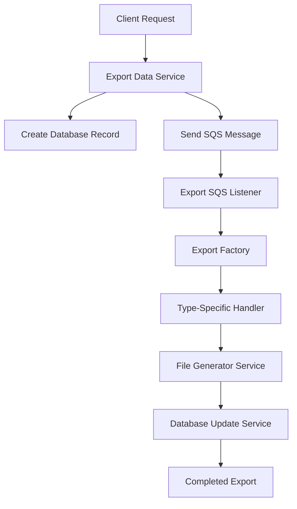

# Export System Architecture

## Overview

The Export System is a scalable, factory-pattern-based solution for handling asynchronous data exports in the Connexus platform. It supports multiple export formats (Excel, CSV, PDF) and different data types (SOW, Client SOW, RFP) through a modular, extensible architecture.

## System Architecture

### High-Level Flow



### Components Overview

| Component               | Purpose                                       | Location                                                |
| ----------------------- | --------------------------------------------- | ------------------------------------------------------- |
| **Export Data Service** | Entry point, creates DB record and queues job | `libs/export-data/`                                     |
| **Export SQS Listener** | Background job processor                      | `apps/background-jobs/src/modules/export-sqs-listener/` |
| **Export Factory**      | Routes requests to appropriate handlers       | `factories/export-factory.service.ts`                   |
| **Type Handlers**       | Business logic for specific export types      | `handlers/`                                             |
| **File Generator**      | Creates files in different formats            | `utils/file-generator.service.ts`                       |
| **Database Service**    | Updates export job status                     | `utils/export-database.service.ts`                      |

## Detailed Component Architecture

### 1. Export Data Service (`libs/export-data/`)

**Purpose**: Entry point for export requests

**Key Functions**:

- Create export job record in database
- Send SQS message to background job queue
- Return job ID for tracking

**Message Structure**:

```typescript
{
  message: "TABLE_EXPORT",
  data: {
    fileType: ExportFileTypes,    // XLSX, CSV, PDF
    type: ExportRequestTypes,     // SOW, CLIENT_SOW, RFP
    exportId: string,             // Database job ID
    userId: string,               // Requesting user
    filters?: Record<string, any> // Query filters
  }
}
```

### 2. Export SQS Listener (`apps/background-jobs/`)

**Purpose**: Background job processor that handles export requests

**Flow**:

1. Receives SQS message
2. Marks job as processing
3. Routes to appropriate handler via factory
4. Processes export
5. Updates database with results

**Error Handling**:

- Catches and logs all errors
- Updates database with failure status
- Re-throws to trigger SQS retry mechanism

### 3. Factory Pattern (`factories/`)

#### Export Factory Interface

```typescript
interface IExportHandler {
  process(jobData: ExportJobData): Promise<ExportResult>;
  validate(jobData: ExportJobData): boolean;
  getSupportedType(): ExportRequestTypes;
}
```

#### Export Factory Service

- **Route Resolution**: Maps export types to handlers
- **Validation**: Ensures handler exists for type
- **Extensibility**: Easy to add new export types

**Handler Mapping**:

```typescript
ExportRequestTypes.SOW → SowExportHandler
ExportRequestTypes.CLIENT_SOW → ClientSowExportHandler (TODO)
ExportRequestTypes.RFP → RfpExportHandler (TODO)
```

### 4. Export Handlers (`handlers/`)

#### SOW Export Handler

**Data Sources**:

- Primary: `ScopeOfWork` table
- Joins: `Services`, `Client`, `Users` (created/modified by)
- Versions: Current `ScopeOfWorkVersion` only

**Field Mapping**:

```typescript
{
  'Services': 'service.servicesName',
  'Scope Of Work Name': 'scopeName',
  'Uploaded By': 'createdBy.fullName',
  'Uploaded Date': 'createdAt',
  'Updated By': 'modifiedBy.fullName',
  'Updated Date': 'updatedAt',
  'Status': 'scopeOfWorkStatus'
}
```

**Query Strategy**:

- Uses same `buildWhereClause` logic as `scope-of-work.service.ts`
- Supports all existing filters (search, status, date ranges, etc.)
- Maintains consistency with UI data display

### 5. File Generator Service (`utils/`)

**Purpose**: Creates files in different formats from structured data

#### Supported Formats

| Format            | Library         | Features                         |
| ----------------- | --------------- | -------------------------------- |
| **Excel (.xlsx)** | `xlsx-js-style` | Styled headers, auto-fit columns |
| **CSV (.csv)**    | `csv-stringify` | Quoted fields, proper escaping   |
| **PDF (.pdf)**    | `pdfkit`        | Tables, pagination, headers      |

#### Data Structure

```typescript
interface ExportData {
  headers: string[];
  rows: (string | number | Date | null)[][];
  title?: string;
}
```

#### Excel Features

- Bold headers with background color
- Auto-fit column widths
- Title row (optional)
- Professional styling

#### PDF Features

- Table structure with borders
- Page breaks for large datasets
- Header/footer support
- Font sizing and styling

### 6. Database Service (`utils/`)

**Purpose**: Manages export job lifecycle in database

#### Status Flow

```
PENDING → PENDING (processing) → COMPLETED/FAILED
```

#### Database Schema

```typescript
{
  id: string;
  type: string;           // Export type
  fileType: string;       // File format
  status: BackgroundJobStatuses;
  createdById: string;
  startedAt?: Date;
  completedAt?: Date;
  fileUrl?: string;       // S3 URL (TODO)
  fileName?: string;      // Generated filename
  errorMessage?: string;  // Error details if failed
}
```

## Configuration & Environment

### Required Environment Variables

```env
EXPORT_QUEUE_URL=https://sqs.region.amazonaws.com/account/queue-name
EXPORT_QUEUE=queue-id
AWS_REGION=us-east-1
AWS_ACCESS_KEY_ID=...
AWS_SECRET_ACCESS_KEY=...
```

### Queue Configuration

- **Queue Type**: SQS (AWS Simple Queue Service)
- **Consumer**: `@ssut/nestjs-sqs`
- **Queue Name**: `export-queue`
- **Retry Policy**: Default SQS retry with DLQ support

## Dependencies

### Production Dependencies

```json
{
  "xlsx-js-style": "^1.2.0", // Excel generation
  "csv-stringify": "^6.5.2", // CSV generation
  "pdfkit": "^0.16.0", // PDF generation
  "date-fns": "^4.1.0", // Date formatting
  "@aws-sdk/client-sqs": "^3.854.0" // SQS client
}
```

### Development Dependencies

```json
{
  "@types/pdfkit": "^0.17.2" // TypeScript types
}
```

## Scalability & Performance

### Horizontal Scaling

- **Multiple Workers**: Can run multiple background job instances
- **Queue-Based**: Natural load balancing through SQS
- **Stateless**: Handlers are stateless and thread-safe

### Performance Optimizations

- **Streaming**: Large datasets processed in chunks
- **Memory Management**: Buffers cleared after file generation
- **Database Indexing**: Export jobs indexed by status and type

### Resource Management

- **Memory**: Files generated in memory buffers
- **CPU**: Processing distributed across queue workers
- **I/O**: Minimal disk usage, direct buffer operations

## Error Handling & Monitoring

### Error Categories

1. **Validation Errors**: Invalid export parameters
2. **Database Errors**: Data retrieval failures
3. **File Generation Errors**: Format-specific issues
4. **Infrastructure Errors**: SQS/AWS service issues

### Monitoring Points

- **Queue Depth**: SQS message backlog
- **Processing Time**: Handler execution duration
- **Error Rate**: Failed vs successful exports
- **Database Status**: Job status distribution

### Logging Strategy

```typescript
// Structured logging with context
logger.log('Processing SOW export', {
  exportId,
  userId,
  fileType,
  recordCount,
});
```

## Security Considerations

### Data Access Control

- **User Validation**: Export jobs tied to authenticated users
- **Tenant Isolation**: Filters respect user's tenant scope
- **Permission Checks**: Inherited from existing service permissions

### File Security

- **Temporary Storage**: Files generated in memory
- **S3 Integration**: Secure file storage with signed URLs (TODO)
- **Access Logs**: All export activities logged

## Testing Strategy

### Unit Tests

- **Handler Logic**: Mock database responses
- **File Generation**: Validate output format
- **Factory Pattern**: Test handler routing

### Integration Tests

- **End-to-End**: Queue message → file generation
- **Database**: Export job lifecycle
- **Error Scenarios**: Failure handling

### Performance Tests

- **Large Datasets**: 10K+ record exports
- **Concurrent Jobs**: Multiple exports running
- **Memory Usage**: Buffer management under load

## Deployment & Operations

### Deployment Requirements

1. **Environment Variables**: Configure queue URLs and AWS credentials
2. **Database Migration**: Export jobs table schema
3. **Queue Setup**: Create SQS queue with appropriate permissions
4. **Scaling**: Configure worker instance count

### Operational Procedures

- **Queue Monitoring**: CloudWatch metrics for SQS
- **Error Recovery**: Manual job retry procedures
- **Capacity Planning**: Worker scaling based on queue depth

## Future Enhancements

### Planned Features

1. **S3 Integration**: File storage and signed URL generation
2. **Email Notifications**: Notify users when exports complete
3. **Export Scheduling**: Recurring export jobs
4. **Data Compression**: ZIP archives for large exports

### Additional Export Types

1. **Client SOW Handler**: For client-specific scope exports
2. **RFP Handler**: For request for proposal exports
3. **Custom Exports**: User-defined field selection

### Performance Improvements

1. **Incremental Exports**: Delta-based export options
2. **Caching**: Redis cache for frequent exports
3. **Streaming**: Large dataset streaming to S3

## Conclusion

The Export System provides a robust, scalable foundation for handling data exports in the Connexus platform. The factory pattern ensures extensibility, while the queue-based architecture enables horizontal scaling. The modular design makes it easy to add new export types and formats as business requirements evolve.
